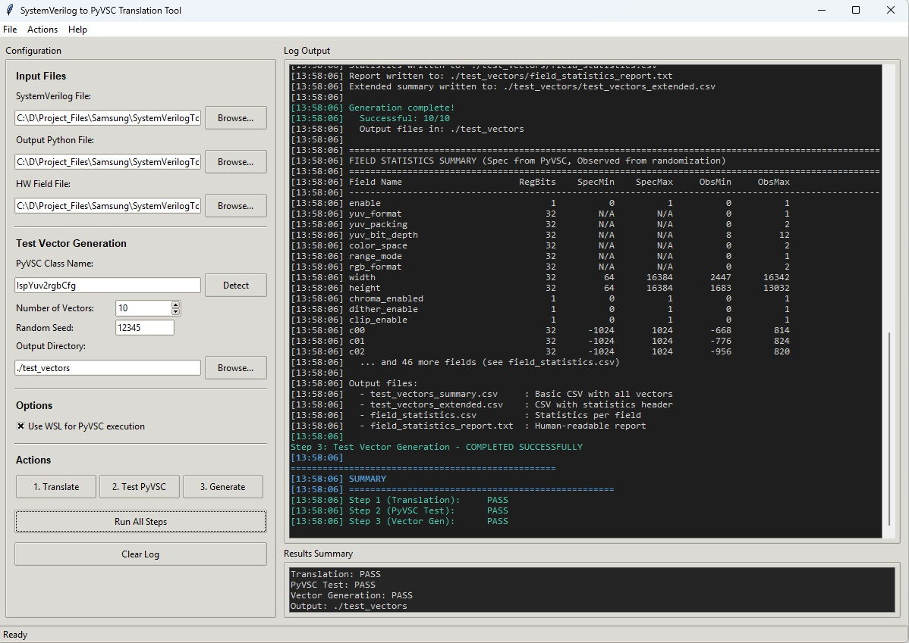

# SV-to-PyVSC Translation Assistant

[](https://github.com/balajimcr/SystemVerilogToPython/actions/workflows/python-tests.yml)
[](https://www.python.org/downloads/)
[](https://opensource.org/licenses/MIT)

A Python tool that assists with manual translation of SystemVerilog constraint-based randomization models to PyVSC (Python Verification Stimulus and Coverage).

## Important Notice

This is a **Translation Assistant**, not an automated converter. The generated code requires **manual review and validation** by a verification engineer to ensure semantic equivalence.

## Features

- **Parses SystemVerilog** constraint classes, enums, and hierarchies
- **Generates PyVSC code** with proper decorators and type mappings
- **GUI workflow** for translation, PyVSC testing, and test-vector generation
- **Translates constraint constructs**:
  - `rand`/`randc` fields with proper type mapping
  - `inside` range constraints → `vsc.rangelist()` (expression form uses `.inside()`)
  - Range constraints (`var >= min && var <= max`) → grouped into `parameter_range` constraint
  - Conditional constraints (`if/else/begin/end`) → `vsc.if_then/else_if/else_then`
  - Weighted distributions (`dist`) → `vsc.dist()`
  - Solve order (`solve before`) → `vsc.solve_order()` (placed first in constraints)
  - Unique constraints → `vsc.unique()`
  - Foreach loops → `vsc.foreach()`
  - Soft constraints → `vsc.soft()`
  - Negated inside → `vsc.not_inside()`
  - Bit slicing (`var[7:0]`) - preserved as-is
  - Logical operators: `&&` → `&`, `||` → `|`, `!` → `~`
  - Signed variables (`rand bit signed [N:0]`) → `vsc.rand_int_t(N)`
  - Standard int types with signed/unsigned support
- **Clean output by default** - no comments or docstrings cluttering the code
- **Verbose mode (-r)** - includes original SV code and metrics in docstrings (metrics/validation only run in `-r` mode)
- **Flags items requiring manual review**
- **Provides translation report** with statistics and warnings
- **Multi-threaded translation** (file-level and class-level)
- **Progress bars** for file/class translation (via `tqdm`)
- **PyVSC randomization test runner** (GUI + CLI)
- **Test vector generation** from PyVSC randomized models (GUI + CLI)
- **Deterministic runs** via random seed for repeatable vectors

## Installation

```bash
# Clone the repository
git clone https://github.com/balajimcr/SystemVerilogToPython.git
cd SystemVerilogToPython

# Install dependencies (pyvsc + tqdm)
pip install -r requirements.txt
```

## Usage

### Command Line

```bash
# Basic translation (clean output, no comments)
python sv_to_pyvsc.py input.sv -o output.py

# With translation report and verbose output (includes original SV in docstrings)
python sv_to_pyvsc.py input.sv -o output.py -r

# Translate all .sv files in a directory (writes .py next to each input)
python sv_to_pyvsc.py path/to/sv_dir

# Translate a glob pattern
python sv_to_pyvsc.py "sv_files/*.sv" -o out_dir

# Multi-threaded translation with progress bar
python sv_to_pyvsc.py path/to/sv_dir --jobs 8 --progress

# Class-level parallelism within a single file
python sv_to_pyvsc.py input.sv --class-jobs 8 --progress
```

Notes:
- `--progress` uses `tqdm`. Disable with `--no-progress` if you don't want a bar.
- When translating multiple files, `-o` must be a directory.

### GUI (Recommended for End-to-End Flow)

Launch the GUI:

```bash
python sv_to_pyvsc_gui.py
```

Or on Windows:

```bat
run_gui.bat
```

GUI capabilities:
- Browse input `.sv`, output `.py`, and `hw_field.txt` files
- Auto-detect PyVSC class name from the SV file
- Run **Step 1** translation, **Step 2** PyVSC randomization test, and **Step 3** test-vector generation
- One-click **Run All Steps** pipeline
- WSL toggle for PyVSC execution (required for PyVSC tests on Windows)
- Live log output with colored status + concise results summary

#### GUI Tool Info

The GUI provides a guided, three-step workflow:
- Step 1: Translate SystemVerilog to PyVSC
- Step 2: Run PyVSC randomization tests
- Step 3: Generate test vectors

Screenshot:



### Test Vector Generation (CLI)

```bash
# Generate 10 test vectors into ./test_vectors
python generate_test_vectors.py example_sv_classes IspYuv2rgbCfg hw_field.txt 10 ./test_vectors

# Deterministic runs
python generate_test_vectors.py example_sv_classes IspYuv2rgbCfg hw_field.txt 100 ./test_vectors --seed 12345
```

### Python API

```python
from sv_to_pyvsc import SVtoPyVSCTranslator

# Create translator (verbose=True to include original SV in output)
translator = SVtoPyVSCTranslator(verbose=False)

# Translate from file (optional parallelism + progress)
result = translator.translate_file('input.sv', 'output.py', jobs=4, progress=True)

# Or translate from string
sv_code = '''
class my_transaction;
    rand bit [7:0] addr;
    constraint c { addr inside {[0:127]}; }
endclass
'''
result = translator.translate_code(sv_code)

# Access results
print(result.pyvsc_code)           # Generated Python code
print(result.warnings)              # Translation warnings
print(result.manual_review_items)   # Items needing review
print(result.statistics)            # Translation statistics

# Print detailed report
translator.print_report(result)
```

## Translation Mapping Reference

### 1. Scalar Fixed-Width Types

#### Bit / Logic Vectors

| SystemVerilog | Meaning | PyVSC (Random) | PyVSC (Non-Random) |
|---------------|---------|----------------|---------------------|
| `rand bit [N-1:0] x;` | Unsigned bit vector | `vsc.rand_bit_t(N)` | `vsc.bit_t(N)` |
| `rand logic [N-1:0] x;` | Same as bit | `vsc.rand_bit_t(N)` | `vsc.bit_t(N)` |
| `rand bit signed [N-1:0] x;` | Signed vector | `vsc.rand_int_t(N)` | `vsc.int_t(N)` |

> ⚠️ **Important**: PyVSC does not model signed bit-vectors directly. If the SV field is signed, map it to an integer type, not `bit_t`.

#### Integer Types (SystemVerilog built-ins)

| SystemVerilog | Width | Signed | PyVSC (Random) | PyVSC (Non-Random) |
|---------------|-------|--------|----------------|---------------------|
| `rand byte` | 8 | yes | `vsc.rand_int8_t()` | `vsc.int8_t()` |
| `rand byte unsigned` | 8 | no | `vsc.rand_uint8_t()` | `vsc.uint8_t()` |
| `rand shortint` | 16 | yes | `vsc.rand_int16_t()` | `vsc.int16_t()` |
| `rand shortint unsigned` | 16 | no | `vsc.rand_uint16_t()` | `vsc.uint16_t()` |
| `rand int` | 32 | yes | `vsc.rand_int32_t()` | `vsc.int32_t()` |
| `rand int unsigned` | 32 | no | `vsc.rand_uint32_t()` | `vsc.uint32_t()` |
| `rand longint` | 64 | yes | `vsc.rand_int64_t()` | `vsc.int64_t()` |
| `rand longint unsigned` | 64 | no | `vsc.rand_uint64_t()` | `vsc.uint64_t()` |

> ✅ **Best practice**: If SV uses `int`, `shortint`, etc. → always use these standard-width PyVSC types, not `bit_t`.

### 2. Arbitrary-Width Scalars

Use these when SV uses custom bit widths that are not standard integers.

| Signed | Random | PyVSC Type | Example SV |
|--------|--------|------------|------------|
| No | Yes | `vsc.rand_bit_t(N)` | `rand bit [13:0]` |
| No | No | `vsc.bit_t(N)` | `bit [9:0]` |
| Yes | Yes | `vsc.rand_int_t(N)` | `rand logic signed [11:0]` |
| Yes | No | `vsc.int_t(N)` | `logic signed [20:0]` |

```python
self.a = vsc.rand_bit_t(14)    # rand bit [13:0]
self.b = vsc.rand_int_t(12)    # rand logic signed [11:0]
```

### 3. Enums

| SystemVerilog | PyVSC |
|---------------|-------|
| `typedef enum {...} e_t; rand e_t x;` | `vsc.rand_enum_t(E)` |
| non-rand enum | `vsc.enum_t(E)` |

```python
class Mode(IntEnum):
    A = 0
    B = 1

self.mode = vsc.rand_enum_t(Mode)
```

### 4. Arrays

#### Fixed-Size Arrays

| SystemVerilog | PyVSC |
|---------------|-------|
| `rand bit [7:0] a[16];` | `vsc.rand_list_t(vsc.bit_t(8), sz=16)` |
| `bit [3:0] b[8];` | `vsc.list_t(vsc.bit_t(4), sz=8)` |

#### Dynamic Arrays

| SystemVerilog | PyVSC |
|---------------|-------|
| `rand bit [7:0] a[];` | `vsc.rand_list_t(vsc.bit_t(8))` |

### 5. Cyclic Randomization (randc)

| SystemVerilog | PyVSC |
|---------------|-------|
| `randc bit [N-1:0] x;` | `vsc.randc_bit_t(N)` |

> ⚠️ No `randc` equivalent for integers or enums in PyVSC.

### 6. Operator Mappings (Constraints)

#### Logical / Boolean Operators

| SystemVerilog | Meaning | PyVSC Equivalent | Notes |
|---------------|---------|------------------|-------|
| `&&` | Logical AND | `&` | PyVSC requires bitwise operators |
| `\|\|` | Logical OR | `\|` | PyVSC requires bitwise operators |
| `!a` | Logical NOT | `~a` | Use parentheses for safety |
| `/` | Integer Division | `//` | **Critical**: SV `/` is integer div |
| `!(a && b)` | NOT (AND) | `~(a & b)` | Exact semantic match |
| `!(a \|\| b)` | NOT (OR) | `~(a \| b)` | Exact semantic match |

### 7. Constraint Constructs

| SystemVerilog | PyVSC |
|---------------|-------|
| `var >= min && var <= max` | `var in vsc.rangelist(vsc.rng(min, max))` |
| `inside {[a:b]}` | `x in vsc.rangelist(vsc.rng(a, b))` |
| `inside {v1, v2}` | `x in vsc.rangelist(v1, v2)` |
| `inside` (expression context) | `x.inside(vsc.rangelist(...))` |
| `!(x inside {...})` | `vsc.not_inside(x, vsc.rangelist(...))` |
| `A -> B` | `with vsc.implies(A): B` (Simple expressions only) |
| `if (c) {...}` | `with vsc.if_then(c): ...` |
| `else if (c) {...}` | `with vsc.else_if(c): ...` |
| `else {...}` | `with vsc.else_then: ...` |
| `if (c) begin ... end` | `with vsc.if_then(c): ...` (multi-line) |
| `if (x)` (bare var) | `with vsc.if_then(x != 0): ...` |
| `if (~x)` (negated) | `with vsc.if_then(x == 0): ...` |
| `dist {v := w}` | `vsc.dist(x, [vsc.weight(v, w)])` |
| `dist {[a:b] :/ w}` | `vsc.dist(x, [vsc.weight(vsc.rng(a,b), w, 'range')])` |
| `solve a before b` | `vsc.solve_order(a, b)` |
| `unique {arr}` | `vsc.unique(arr)` |
| `foreach (a[i]) {...}` | `with vsc.foreach(a, idx=True) as i: ...` |
| `soft x == v` | `vsc.soft(x == v)` |
| `arr.size() == N` | `arr.size == N` |
| `var[7:0]` | `var[7:0]` (preserved) |

### 8. Quick Translation Checklist

- ✅ Unsigned bit vector → `rand_bit_t(N)`
- ✅ Signed field → never `bit_t`, always `int*_t` or `int_t(N)`
- ✅ SV `int` → `rand_int32_t()` (not `rand_bit_t(32)`)
- ✅ SV `int unsigned` → `rand_uint32_t()`
- ✅ Enums → Python `IntEnum` + `rand_enum_t`
- ✅ Arrays → `rand_list_t(inner_type)`
- ✅ Prefer standard widths (8/16/32/64) when possible
- ✅ `&&` → `&`, `||` → `|`, `!` → `~`
- ✅ `a / b` → `a // b` (Integer division)

### Constraint Ordering

- `vsc.solve_order()` statements are automatically placed at the beginning of each constraint
- The relative order of solve_order statements is preserved from the original SV

## Recent Fixes

All listed cases now generate correct PyVSC code:
- `cr_inside_if`: inside in `if_then` uses `.inside()` ✅
- `cr_inside_else_if`: inside in both `if_then` and `else_if` uses `.inside()` ✅
- `cr_negation`: `!(a == 0)` converts to `(a != 0)` ✅
- `cr_implication_inside_antecedent`: inside in `implies` uses `.inside()` ✅

Summary of fixes applied:

| SystemVerilog Pattern | Previous (broken) | Fixed PyVSC |
|---|---|---|
| `if (x inside {...})` | `x in vsc.rangelist()` | `x.inside(vsc.rangelist())` |
| `!(a == b)` | `~(a == b)` | `(a != b)` |
| `!(a > b)` | `~(a > b)` | `(a <= b)` |
| `!var` | `~var` | `(var == 0)` |

## Example

### Input (SystemVerilog)

```systemverilog
class axi_transaction;
    rand bit [31:0] addr;
    rand bit signed [15:0] offset;
    rand bit [7:0] len;

    constraint addr_range_c {
        addr >= 0 && addr <= 4095;
    }

    constraint offset_range_c {
        offset >= -1024 && offset <= 1023;
    }

    constraint len_c {
        if (addr[3:0] == 0)
            len inside {1, 2, 4, 8};
        else
            len == 1;

        solve addr before len;
    }
endclass
```

### Output (PyVSC)

```python
@vsc.randobj
class AxiTransaction:
    def __init__(self):
        self.addr = vsc.rand_bit_t(32)
        self.offset = vsc.rand_int_t(16)  # signed bit vector -> int_t
        self.len = vsc.rand_bit_t(8)

    @vsc.constraint
    def parameter_range(self):
        # Simple range constraints are grouped together
        self.addr in vsc.rangelist(vsc.rng(0, 4095))
        self.offset in vsc.rangelist(vsc.rng(-1024, 1023))

    @vsc.constraint
    def len_c(self):
        vsc.solve_order(self.addr, self.len)
        with vsc.if_then(self.addr[3:0] == 0):
            self.len in vsc.rangelist(1, 2, 4, 8)
        with vsc.else_then:
            self.len == 1
```

## Known Limitations

1. **Complex nested conditionals** - May need restructuring
2. **Complex Implications** - `->` works for simple expressions; blocks `{}` require manual conversion
3. **Loop variables** in foreach - May get incorrect `self.` prefix
4. **Multi-file runs** - Translation report is only printed for single-file runs

## Project Structure

```
SystemVerilogToPython/
├── sv_to_pyvsc.py           # Main translator
├── sv_to_pyvsc_gui.py       # Tkinter GUI wrapper (translate/test/generate)
├── generate_test_vectors.py # PyVSC test vector generator
├── validation_utils.py       # Validation utilities
├── example_sv_classes.sv     # Example SV input
├── example_sv_classes.py     # Example translated output
├── install_pyvsc.bat         # Windows install helper (legacy)
├── install_pyvsc_wsl.bat     # WSL install helper for PyVSC
├── run_example.bat           # Windows example runner
├── run_gui.bat               # Windows GUI launcher
├── README.md                 # This file
├── CLAUDE.md                 # Development guidelines
├── requirements.txt          # Python dependencies
└── .github/
    └── workflows/
        └── python-tests.yml  # GitHub Actions CI
```

## Development

### Running Tests

```bash
# Run the translator on example file
python sv_to_pyvsc.py example_sv_classes.sv -o example_sv_classes.py

# Verify syntax of generated code
python -m py_compile example_sv_classes.py

# Run with pyvsc (if installed)
python example_sv_classes.py
```

### Validation

The tool includes validation utilities:

```python
from validation_utils import PyVSCValidator

validator = PyVSCValidator(MyTransactionClass)
results = validator.validate_all(iterations=10000)
validator.print_report()
```

## Contributing

Contributions welcome! Please ensure all translations maintain semantic fidelity with the original SystemVerilog.

1. Fork the repository
2. Create a feature branch
3. Make your changes
4. Run tests to ensure nothing is broken
5. Submit a pull request

## License

MIT License
